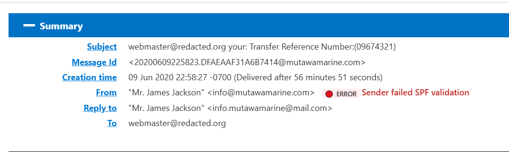
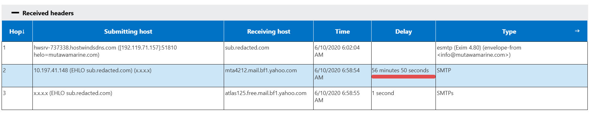
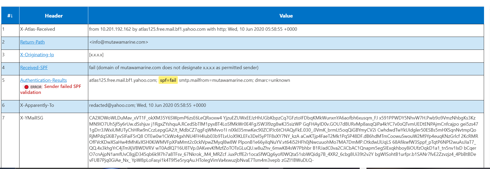
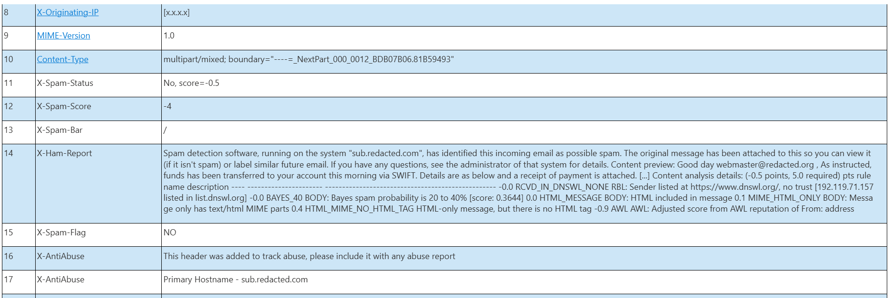
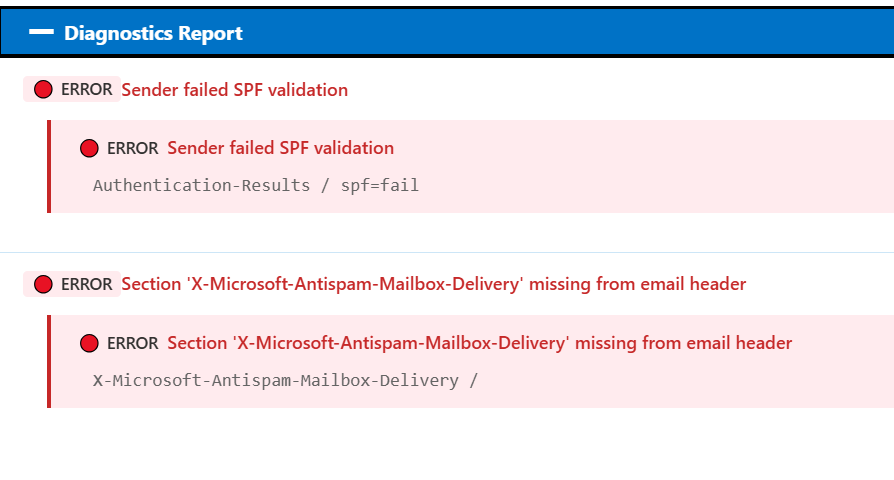

# Phishing Email Analysis — Suspicious SWIFT Transfer Notification


---

# Overview

This project documents the investigation and analysis of a suspicious phishing email impersonating a SWIFT bank transfer notification.

The email claimed that funds had been transferred and included a payment receipt attachment. The objective of this investigation was to analyze the email headers, identify phishing indicators, review email authentication results, and extract Indicators of Compromise (IOCs).

---

# Investigation Objectives

- Analyze suspicious email headers
- Identify spoofing indicators
- Review SPF/DMARC authentication failures
- Trace email routing path
- Extract IOCs
- Map observed techniques to MITRE ATT&CK
- Simulate SOC analyst investigation workflow

---

# Email Summary

| Field | Value |
|---|---|
| Subject | Transfer Reference Number:(09674321) |
| Sender | info@mutawamarine.com |
| Reply-To | info.mutawamarine@mail.com |
| Message Type | Financial-themed phishing |
| Attachment Mentioned | Yes |
| SPF Result | Fail |
| Delivery Delay | 56 minutes |

---

# Initial Findings

The email claimed:

> “Funds has been transferred to your account this morning via SWIFT.”

This type of message is commonly used in phishing campaigns to:
- create urgency
- trick users into opening attachments
- deliver malware
- steal banking credentials

---

# Sender Analysis

## From Address

```text
info@mutawamarine.com
```

## Reply-To Address

```text
info.mutawamarine@mail.com
```

## Observation

The Reply-To domain differs from the sender domain.

This is a strong phishing indicator because attackers frequently:
- spoof legitimate business domains
- redirect replies to anonymous/free mail services

---

# SPF Authentication Failure

## SPF Result

```text
spf=fail
```

## Detailed Output

```text
domain of mutawamarine.com does not designate 192.119.71.157 as permitted sender
```

## Analysis

SPF (Sender Policy Framework) verifies whether a server is authorized to send emails on behalf of a domain.

The SPF failure indicates:
- the sender server was not authorized
- the domain may have been spoofed
- sender identity cannot be trusted

This is one of the strongest indicators of phishing in this email.

---

# Email Routing Analysis

## Hop 1 — Originating Server

```text
Host: hwsrv-737338.hostwindsdns.com
IP: 192.119.71.157
```

### Analysis

This appears to be the originating mail server responsible for sending the email.

Potential concerns:
- suspicious mail infrastructure
- compromised hosting server
- malicious SMTP activity

---

## Hop 2 — Yahoo Mail Transfer

```text
Delay: 56 minutes 50 seconds
```

### Analysis

The unusually long delay may indicate:
- spam filtering
- mail queue inspection
- greylisting
- suspicious message processing

---

## Hop 3 — Final Delivery

The message was eventually processed by Yahoo mail infrastructure.

No successful sender authentication indicators were observed.

---

# Spam Filter Analysis

## Spam Score

```text
score=-0.5
required=5.0
```

## Analysis

The spam filter did not strongly classify the message as spam despite several suspicious indicators.

This demonstrates how:
- phishing emails may bypass filters
- low-volume campaigns evade detection
- manual analysis remains important

---

# Authentication Results

| Security Check | Result | Interpretation |
|---|---|---|
| SPF | FAIL | Unauthorized sender |
| DKIM | Missing | No cryptographic verification |
| DMARC | Unknown | Weak domain protection |

---

# Indicators of Compromise (IOCs)

## Domains

```text
mutawamarine.com
mail.com
```

## IP Address

```text
192.119.71.157
```

## Subject Pattern

```text
Transfer Reference Number
```

---

# MITRE ATT&CK Mapping

| Technique ID | Technique |
|---|---|
| T1566.001 | Spearphishing Attachment |
| T1656 | Impersonation |
| T1586 | Compromise Accounts |

---

# Screenshots

## Email Header Analysis






## SPF & DKIM Failure Result




## Email Body


## Virustotal Report (Email Attachment)


---

# Recommended SOC Actions

1. Quarantine the email
2. Extract and sandbox attachments
3. Analyze attachment hashes
4. Investigate sender IP reputation
5. Block malicious domains/IPs
6. Search SIEM for similar emails
7. Alert affected users
8. Update email filtering rules

---

# Final Assessment

This email contains multiple indicators commonly associated with phishing campaigns:

- SPF authentication failure
- Reply-To mismatch
- Financial-themed social engineering
- Attachment-based lure
- Sender spoofing indicators

Based on the evidence collected, the email is highly suspicious and should be treated as a phishing attempt.

---

# Tools & Concepts Used

- Email Header Analyzer
- SMTP Routing Analysis
- SPF Authentication Review
- Threat Intelligence Concepts
- SOC Investigation Methodology

---

# Disclaimer

This project was conducted strictly for cybersecurity education and threat analysis purposes. Sensitive information and domains were redacted where appropriate.

---

Added phishing email investigation project
